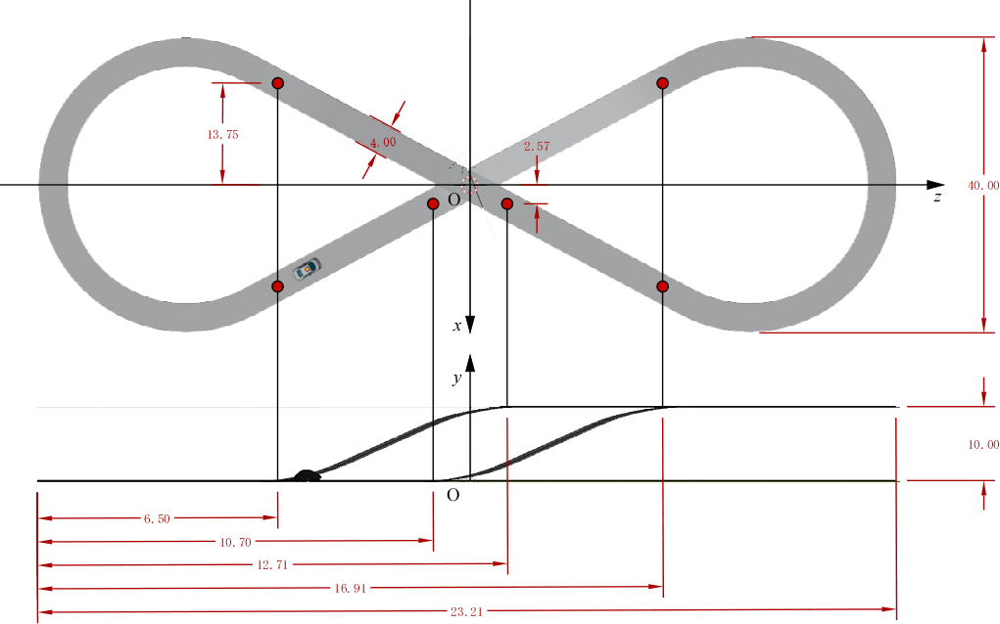

# ggsampleC - 自由課題 C (Catmull-Rom 曲線によるコース走行シミュレーション)

## 1. 概要

本プログラムは、[ゲームグラフィックス特論](https://tokoik.github.io/gg/)の自由課題 C 用のひな型プログラムです。

- 講義ポータル: [ゲームグラフィックス特論 - 床井研究室](https://tokoik.github.io/gg/)

## 2. 課題の内容

本プロジェクト (ggsampleC) は、車っぽいモデル (`vehicle.obj`) とサーキットっぽい 3D モデル (`course.obj`) を読み込んで、陰影をつけて表示するプログラムです。以下の指示に従って変更してください。

1. **TODO: 設問（１）** のコメントの部分に１次元の Catmull-Rom 曲線による補間を求めるプログラムを実装してください。
2. **TODO: 設問（２）** にある車両の姿勢 (位置と方向) の配列変数 `p` の各要素を、既に定義している関数 `interpolate()` もしくは `curve()` を用いて現在時刻 `t` で変化させて、アニメーションの周期 `cycle` ごとに車がコース上を一周するようにしてください。
3. 関数 `curve()` はヒントとして用意したものなので、この関数の使用は必須ではありません。もし `curve()` を使うなら、コース上の通過点における車っぽいもの vehicle の位置と角度を格納した 4 要素の配列を要素とする 2 次元配列を引数 `const float p[][4]` に指定し、さらにそれらの通過点を通過する時刻の配列を引数 `const float t[]` に指定します。また引数 `n` には通過点の数、引数 `u` には現在時刻を指定します。
4. 修正したソースプログラム `ggsampleC.cpp` を提出してください。

### コースの形状

コースの形は次のようになっています。



### ヒント：関数のループ接続

関数 `curve()` の下記の部分:

```cpp
      // ひとつ前の点
      int i0{ i - 1 };
      if (i0 < 0) i0 = 0;

      // 開始点
      int i1{ i };

      // 終了点
      int i2{ i + 1 };

      // ひとつ次の点
      int i3{ i + 2 };
      if (i3 > n) i3 = n;
```

を次のように書き換えると、最後の点の次が最初の点になるので、曲線の最初と最後を滑らかにつなぐことができます。

```cpp
      // ひとつ前の点
      int i0{ i - 1 };
      if (i0 < 0) i0 = n;

      // 開始点
      int i1{ i };

      // 終了点
      int i2{ i + 1 };

      // ひとつ次の点
      int i3{ i + 2 };
      if (i3 > n) i3 = 0;
```

> [!NOTE]
> 車のモデル (`vehicle.obj`) の表示が小さいわりにポリゴン数が多いため、Debug ビルドでは実行開始（モデル読み込み）に結構時間がかかります。

## 3. 対応環境

- **Windows**: Visual Studio 2019 / 2022 / 2026 (CMake 経由で GLFW 3.4 を自動ダウンロード)
- **macOS**: Xcode (GLFW 3.4 を自動ダウンロード、OpenGL Framework を使用)
- **Ubuntu Linux**: GCC / Make (システム標準の libglfw3-dev, libgl1-mesa-dev を使用)

## 4. ビルド手順

### Windows (Visual Studio)

```pwsh
cmake -B build -S .
cmake --build build --config Release
```

### macOS (Xcode)

```bash
cmake -B build -G Xcode
cmake --build build --config Release
```

### Ubuntu Linux (Makefile)

```bash
sudo apt-get update
sudo apt-get install -y libglfw3-dev libgl1-mesa-dev
cmake -B build -S .
cmake --build build
```

## 5. 起動方法

ビルド完了後、生成された実行ファイルを実行します。

- **Windows**: `build/Release/ggsampleC.exe`
- **macOS**: `build/Release/ggsampleC.app`
- **Linux**: `build/ggsampleC`

## 6. 操作方法

- **[q] / [Q] / [ESC]**: プログラムの終了
